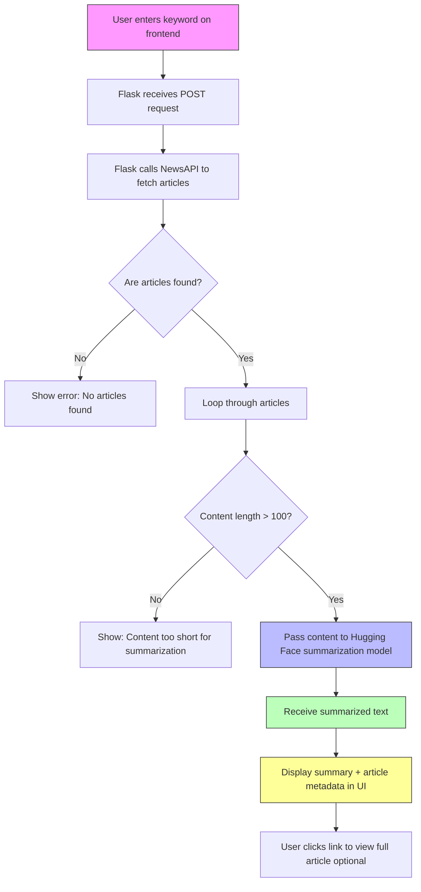

# News Summarizer

This web application allows users to input a keyword, fetches related news articles using the NewsAPI, and summarizes them using a fine-tuned FLAN-T5 model through Hugging Face Transformers.

## 🖼️ Project Architecture

 <!-- Replace with actual image path -->



## 🛠️ Technologies Used

- **Frontend**: HTML, CSS, JavaScript
- **Backend**: Flask (Python)
- **Summarization**: FLAN-T5 (Fine-tuned using Hugging Face Transformers)
- **News API**: NewsAPI.org
- **Data Preprocessing**: Custom cleaning pipeline

## 🚀 How to Run

### Prerequisites

- Python 3.8+
- Install dependencies:

```bash
pip install -r requirements.txt
```

### Run the App

```bash
python app.py
```

Then, open `http://localhost:5000` in your browser.

## 🧪 Future Improvements

- Add user login and summary history
- Support summarization in multiple languages
- Allow export of summaries (PDF, DOCX, etc.)
- Integrate more summarization models (BART, T5)

